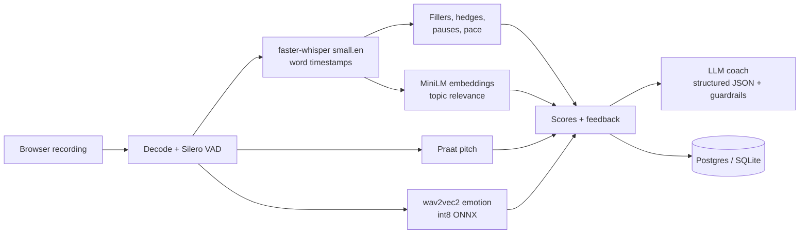

# Confident Talk Analyzer

Practise speaking out loud and get told, specifically, how to get better. Record an interview answer, a
JAM round, a presentation, a news reading or a pitch: speech models measure *how* you sound, an LLM coach
reviews *what* you said, and your progress is tracked session by session.

**Live demo:** https://amal211005-confident-talk-analyzer.hf.space (click **Try it as a guest**; no sign-up)

## What it does

- **8 practice modes**, each with its own rules, timer and coaching: Free practice, Interview (role-based
  questions), JAM (with a referee for hesitation, repetition and deviation), Snap talk, Read aloud (from a
  passage or your own document), Presentation (with slide upload and review), Pitch, and GD / Debate.
- **10 delivery skills measured**: pace, filler words, hesitation pauses, pitch variation, vocal
  confidence, hedging language, reading accuracy, timing, structure (STAR, PREP...) and topic relevance.
- **An AI coach** that checks your structure against the mode's framework, quotes what you actually said,
  and writes a stronger version of your answer without inventing facts you didn't give it.
- **Progress tracking**: replay any old session, see your weakest skills and what to practise next.

## How it works



| Stage | Model / method | Why |
|---|---|---|
| Speech detection | Silero VAD | Real pause lengths, independent of the transcript |
| Transcription | faster-whisper `small.en`, int8 on CPU | Word timestamps; a prompt keeps *um/uh* that Whisper normally deletes |
| Pitch | Praat (parselmouth) | Monotone vs. varied delivery, uptalk |
| Vocal confidence | audeering wav2vec2 (arousal, dominance, valence), quantized to int8 ONNX | 3x smaller, about 2x faster on CPU |
| Topic relevance | all-MiniLM-L6-v2 ONNX embeddings | On/off-topic checks and document matching |
| Coach | Any OpenAI-compatible LLM (Groq `gpt-oss-120b` by default) | JSON-schema output, validated and retried |

**Guardrails on the LLM coach.** Its answer must match a JSON schema (retried if not). A rewrite that
contains numbers the speaker never said has them replaced, and a rewrite that is mostly new content
(rather than your answer improved) is swapped for a fill-in-the-blanks template. Framework parts are
checked against the mode's framework. Feedback is cleaned of chatbot phrasing.

## Evaluation

Every component is measured, not just eyeballed ([backend/evals](backend/evals)).

**Speech pipeline**: 53 labelled clips with exact word timings, scripted fillers, hedges and pauses
([full report](backend/evals/results/REPORT.md)):

| Part | Metric | Result |
|---|---|---|
| Transcription | Word error rate (clean voices) | 0.8% |
| Fillers / hedges | F1 | 100% / 100% |
| Pauses | Hesitation-pause F1 | 94.7% (was 33% before the eval-driven fix) |
| Pace | Mean words-per-minute error | 0.9% |
| Read aloud | Verdict accuracy | 100% (was 85%) |
| Documents | Located section overlap (IoU) | 100% |

**Real-world accents**: on [Svarah](https://huggingface.co/datasets/ai4bharat/Svarah) (Indian-accented
English from 117 speakers), the app's speech model has a **14.3%** word error rate. This eval found that
Whisper's filler prompt can make it skip whole sentences (12–19 s in 3 of 4 recordings); the app now
detects speech with no words and re-transcribes just those stretches
([report](backend/evals/results/REALWORLD.md)).

**AI coach**: 14 transcripts ([report](backend/evals/results/COACH.md)): 100% valid structured answers
on the first try, 100% agreement with human on/off-topic labels, invented numbers in tips cut from 50%
of answers to 0 by the guardrail, and one-line answers given a template instead of a made-up story 100%
of the time.

## Run it locally

Python 3.10, Windows/macOS/Linux.

```bash
cd backend
python -m venv venv
venv/Scripts/activate            # macOS/Linux: source venv/bin/activate
pip install -r requirements-dev.txt
python scripts/prepare_emotion_model.py   # one-time: downloads and quantizes the emotion model
python app.py                    # http://localhost:5000
```

Optional settings go in `backend/.env`: `GROQ_API_KEY` for the AI coach (free key from Groq),
`DATABASE_URL` for Postgres instead of the local SQLite file, `WHISPER_MODEL` to change the speech model.

Tests: `python -m pytest` (263 tests), or `TEST_POSTGRES=1 python -m pytest` to run them against a
throwaway local Postgres. CI runs both on every push.

## Deploy

The [Dockerfile](Dockerfile) builds one image with the models baked in (port 7860), made for a free
Hugging Face Docker Space. Set these as Space secrets: `SECRET_KEY` (any long random string),
`DATABASE_URL` (a free [Neon](https://neon.tech) Postgres), and `GROQ_API_KEY`.

## Credits and licences

Speech-emotion model: audeering `w2v2-L-robust-12` (CC BY-NC-SA 4.0, non-commercial). Evaluation data:
Svarah by AI4Bharat (CC BY 4.0). Also faster-whisper (MIT), Silero VAD (MIT), Praat/parselmouth (GPL),
all-MiniLM-L6-v2 (Apache 2.0).
